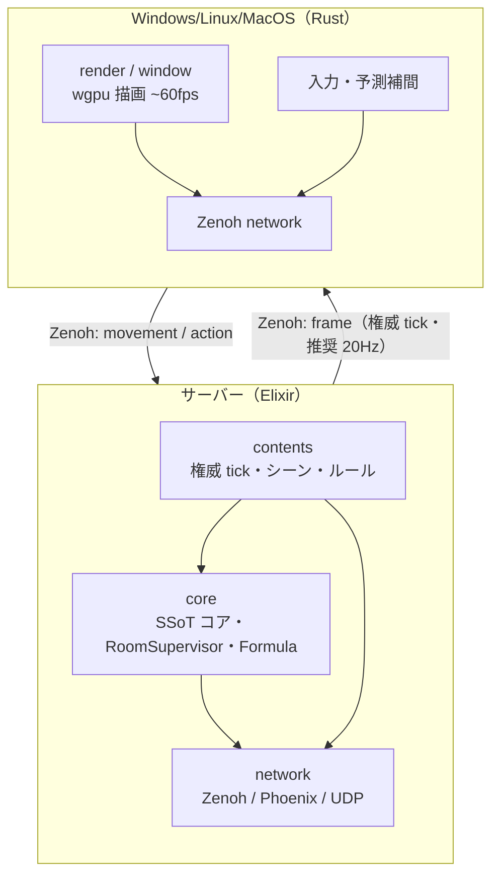

# AlchemyEngine
  

> A platform for worlds. You bring the rules.

3D空間とそこに存在するユーザーを保証する Elixir x Rust 製のエンジンです。

詳細は [ビジョンと設計思想](./docs/vision.md) を参照。

## 🏗️ Architecture

### 全体構成



> クライアント・サーバー分離の詳細と実装手順は [client-server-separation-procedure.md](./workspace/7_done/client-server-separation-procedure.md) を参照。未実施項目は [client-server-separation-future.md](./workspace/0_reference/client-server-separation-future.md)。主時間の正本は [authoritative-state-sync-policy.md](./docs/architecture/authoritative-state-sync-policy.md)。

## ハイライト

- **二層の SSoT（ドメインは Elixir、ワイヤは経路ごと）**
> **ドメイン**（権威ある状態・ルール・コンテンツ定義）は Elixir 側で管理します。クライアント用のコードをそのままヘッドレスのマルチプレイサーバーとして転用可能です。1000人規模のプレイヤーが交差する大規模ネットワークも Elixir の並行処理能力で捌きます。
>
> **ワイヤ**（バイト列や JSON の「形」の合意）は **経路・形式ごとに** SSoT が異なります（例: Zenoh の `RenderFrame` 等の **Protobuf** は submodule **`3rdparty/alchemy-protocol/proto`**、UDP 外枠は `Network.UDP.Protocol`、Phoenix はチャネルごとの JSON）。生成は [development.md の Protobuf 節](./development.md#protobuf-proto)。全体の整理は [アーキテクチャ概要 — 設計思想](./docs/architecture/overview.md#設計思想) を参照。
- **主時間は Elixir（推奨 20Hz）／表示は Rust（~60fps）**
> **権威 tick**（公式状態のコミット）は Elixir。デフォルト **20Hz**。設定で 10 / 30 / 非推奨 60Hz。クライアントは描画ループで **予測・補間**し、主時間の間を埋める（[authoritative-state-sync-policy.md](./docs/architecture/authoritative-state-sync-policy.md)）。
>
> サーバー NIF は **Formula VM** のみ。ゲーム用 60Hz 物理ループはない。描画・入力・DSP はクライアント Rust。
- **Zero NIF Serialization Overhead**
> Elixir <--> Rust（NIF）の通信は軽量な識別子・式呼び出しに限定。フレーム配信は Zenoh / protobuf。
- **SuperCollider-inspired Audio**
> Elixir が「指揮者」として非同期コマンドを発行し、Rust クライアントの専用経路が DSP 処理を行います。複雑な空間オーディオと動的ルーティングを低遅延で実現します。

詳細は [プラス点 詳細一覧](./docs/evaluation/specific-strengths-2026-08-25.md) を参照。

## 🚀 Getting Started

### Prerequisites

開発環境に以下のツールがインストールされている必要があります。

- [Elixir](https://elixir-lang.org/install.html) **1.19 / OTP 28**
- [Rust](https://www.rust-lang.org/tools/install) (stable)
- [zenohd](https://github.com/eclipse-zenoh/zenohd)（一括起動・リモート起動時）: `cargo install eclipse-zenoh`

### Setup & Run

```bash
git clone --recurse-submodules git@github.com:FRICK-ELDY/alchemy-engine.git
cd alchemy-engine
# 既に clone 済みの場合: git submodule update --init --recursive
mix deps.get
mix alchemy.setup
mix alchemy.server
```

`mix alchemy.server` はサーバーのみ起動します。ゲームをプレイするには `zenohd` + サーバー + VRAlchemy の 3 プロセスが必要です。一括起動は別リポジトリ `../alchemy-launcher` で実行してください。

**開発者向け**: 起動手順の詳細・ランチャー・品質保証コマンドなどは [development.md](./development.md) を参照してください。

---

## ✅ 品質保証

すべての push で GitHub Actions が自動実行されます。

| 対象 | チェック |
|:---|:---|
| Rust | `cargo fmt` / `cargo clippy` / `cargo test` |
| Elixir | `mix format` / `mix credo` / `mix compile` / `mix test` |
| main のみ | `cargo bench` のリグレッション検知 |

詳細は [development.md](./development.md) および [docs/warranty/ci.md](./docs/warranty/ci.md) を参照。

---

## 🤝 Contributing

（※チーム開発時のガイドラインや、コントリビューションルールの詳細をここに記載します）

---

## 📄 License

This project is licensed under the [Eclipse Public License 2.0 (EPL-2.0)](LICENSE).
