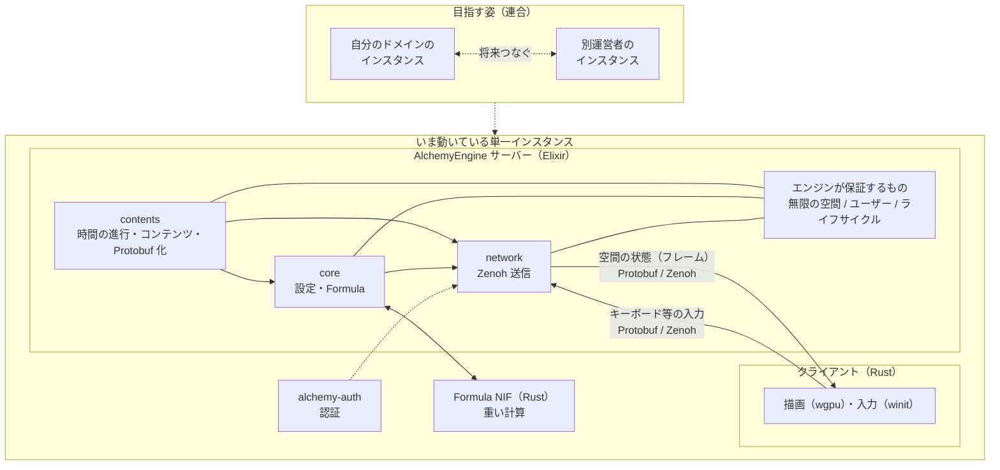

# SWEST28 予約投稿原稿（A4・1枚版）

> 対象: SWEST28 インタラクティブセッション  
> 用途: A4 1枚の予約投稿。提出時は PDF 化する。

---

分散連合型VRプラットフォームの開発と研究  
Development and research of a federated VR platform

FRICK-ELDY フリック/FRICK

## 概要

本研究では、個人や組織が自分のドメインで VR 空間を運営し、インスタンス同士が連合できる分散連合型 VR プラットフォーム AlchemyEngine の開発と研究について発表します。

既存の VR プラットフォームの多くは、単一の運営者による閉じたサービスか、特定のエンジン前提の実装です。テキストの SNS では Mastodon や Misskey のようにセルフホストと連合が成立していますが、3D 空間とリアルタイム同期を対象にした同様の基盤はまだ少ない、と考えています。

AlchemyEngine は、エンジンが保証するものを「無限の3D空間」と「そこに存在するユーザー」に限定します。空間の上に何を置くかはすべてコンテンツであり、利用者がコンポーネントとして持ち込みます。空間の正しい状態はサーバー（Elixir）が決め、描画と入力は Rust クライアントが担います。最終的には、各運営者がインスタンスを立て、合意したプロトコルで空間同士をつなぐことを目指しています。

## 方法

zenohd（`mix alchemy.router`）、サーバー（`mix alchemy.server`）、クライアント（`mix alchemy.client`）を起動して単一インスタンスを動かします。サーバーは Elixir Umbrella で、`contents`（時間の進行・コンテンツ）、`core`（設定・Formula VM）、`network`（Zenoh）に分けています。重い計算は Rust NIF の Formula VM へ渡し、「今、空間がどうなっているか」の正しい答えはサーバーが持ちます。各空間は OTP のプロセスとして隔離します。

クライアントは Rust（wgpu / winit）で描画し、入力と空間の状態のやり取りは Zenoh で行います。フレームや入力の形は alchemy-protocol の Protobuf で揃えます。認証は別サービス alchemy-auth が担当します。

## AlchemyEngine のアーキテクチャ

流れは次のとおりです。(1) サーバーの `contents` が進めた空間の状態を Protobuf のバイナリにし、`network` が Zenoh で送る。(2) クライアントが受け取り、画面に描画する。(3) 入力は Zenoh でサーバーへ戻り、空間の状態に反映される。(4) 必要なときだけ重い計算を Formula NIF に渡し、正しい状態はサーバーが持ち続ける。認証は alchemy-auth が担当し、サーバーの `network` 側で検証します。いま動いているのは単一インスタンスです。別運営者のサーバとつながる連合はこれからで、後から足しやすい形で設計しています。

## 結果と考察

Elixir サーバーと Rust クライアントを分けた構成で、3D 空間の状態をリアルタイムに同期できることを確認しました。サーバーが進めた状態を Protobuf で Zenoh 送信し、クライアントが描画します。キーボード入力も Zenoh でサーバーへ戻り、空間に反映されます。エンジンはコンテンツの中身を知らず、コンポーネントのライフサイクルに応答する分離も実装できています。

自前ホスト可能な VR 空間の基盤を、エンジンとコンテンツの境界として定義できることが示されました。今後はインスタンス同士をつなぐ仕組みを進め、教育や共同作業などへの応用を目指します。

## 参考文献

[1] FRICK-ELDY: AlchemyEngine, 2026, https://github.com/FRICK-ELDY/alchemy-engine  
[2] Elixir Team: Elixir, 2026, https://elixir-lang.org/  
[3] Eclipse Foundation: Zenoh, 2026, https://zenoh.io/  
