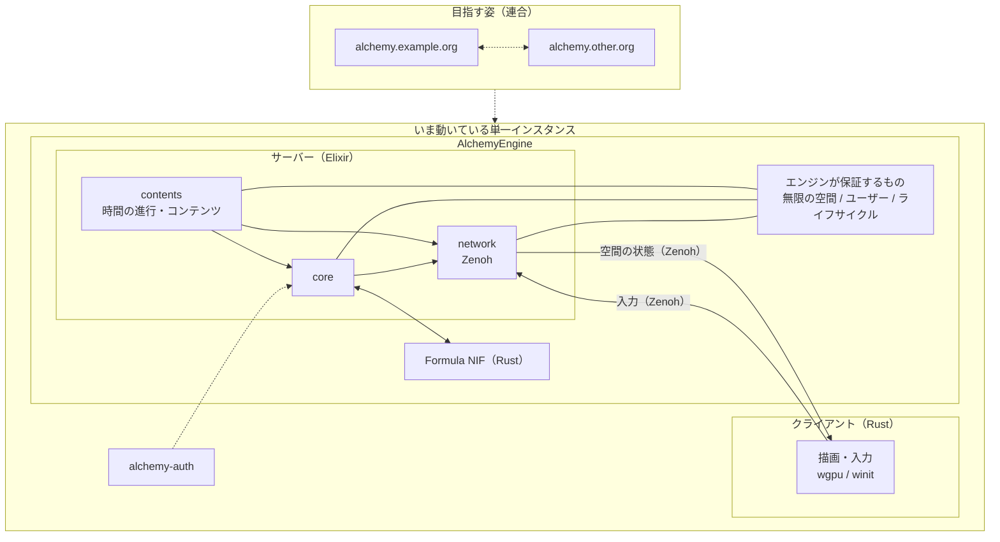

# SWEST28 予約投稿原稿（草案）

> 対象: 第28回 組込みシステム技術に関するサマーワークショップ（SWEST28）  
> 日程: 2026年8月27日（木）〜28日（金）／下呂温泉 水明館  
> 部門: インタラクティブセッション 研究発表部門  
> 用途: 申込時の予約投稿（一枚もの）。提出時は PDF 化する。

---

分散連合型VRプラットフォームの開発と研究  
Development and research of a federated VR platform

FRICK-ELDY フリック/FRICK

## 概要

本研究では、個人や組織が自分のドメインで VR 空間を運営し、インスタンス同士が連合できる分散連合型 VR プラットフォーム AlchemyEngine の開発と研究について発表します。

既存の VR プラットフォームの多くは、単一の運営者による閉じたサービスか、特定のエンジン前提の実装です。誰でも自分の空間を持ち、その上にコンテンツを作り、他の空間と繋がる、という形にはなりにくい状況があります。テキストの SNS では Mastodon や Misskey のようにセルフホストと連合が成立していますが、3D 空間とリアルタイム同期を対象にした同様の基盤はまだ少ない、と考えています。

AlchemyEngine は、エンジンが保証するものを「無限の3D空間」と「そこに存在するユーザー」に限定します。空間の上に何を置くか——機器、資料、3D モデル、通信の可視化、その他の体験——はすべてコンテンツであり、利用者がコンポーネントとして持ち込みます。空間の正しい状態と時間の進み方はサーバー（Elixir）が決め、描画と入力は Rust クライアントが担います。最終的には、`alchemy.{ドメイン}` のように各運営者がインスタンスを立て、合意したプロトコルで空間・アイデンティティ・コンテンツを連合させることを目指しています。

## 方法

まず単一インスタンスとして基盤を起動します。alchemy-engine をサブモジュール付きでクローンし、`mix alchemy.setup` で Elixir / Rust の開発環境を整えます。リアルタイム通信のルータとして zenohd を起動（`mix alchemy.router`）し、続けてサーバー（`mix alchemy.server`）とクライアント（`mix alchemy.client`）を起動します。一括起動には別リポジトリの alchemy-launcher を用います。

サーバーは Elixir Umbrella で構成します。`contents` がシーン・コンポーネント・時間の進行を、`core` が設定・Formula VM 橋渡しを、`network` が Zenoh などを担当します。人が増えたとき、同じ運営者がサーバを複数台に増やす仕組み（libcluster）は用意しています。一方、別の運営者が立てたサーバ同士をつなぐ「連合」は別の話として切り分けています。重い計算は Rust NIF の Formula VM（`run_formula_bytecode`）へオフロードします。ただし「今、空間がどうなっているか」の正しい答えはサーバー（Elixir）が持ち、クライアントはそれに合わせて表示します。各空間は OTP のプロセスとして隔離します。

クライアントは Rust（wgpu / winit）で空間を描画します。キーボードなどの入力と、空間の状態の受け取りは Zenoh で行います。サーバーとクライアントが共有するフレームや入力の形は、alchemy-protocol の Protobuf を契約とします。空間に載せる内容は `config :server, :current` で切り替えます。ユーザー認証は別サービス alchemy-auth が担当し、エンジン本体から切り離しています。

## AlchemyEngine のアーキテクチャ

いま動いているのは、1 つの運営者が立てる単一インスタンスです。連合（別の運営者のサーバとつながること）はこれからで、今の設計では「後から足しても邪魔にならない」ことを意識しています。空間の正しい状態は Elixir が決め、クライアントとのやり取りのバイト列の形は Protobuf で揃えています。

## 結果と考察

AlchemyEngine のプロトタイプとして、Elixir サーバーと Rust クライアントを分けた構成で、同じ 3D 空間の状態をリアルタイムに同期できることを確認しました。具体的には、サーバーが進めた空間の状態を Protobuf のフレームとして Zenoh で送り、クライアントが描画する経路が動作しています。キーボード入力も Zenoh でサーバーへ戻り、空間の状態に反映されます。エンジンは特定のコンテンツの中身を知らず、コンポーネントがライフサイクル（`on_ready` / `on_process` / `on_event` 等）に応答する分離も実装できています。

この結果から、閉じた単一サービスではなく、自前ホスト可能な VR 空間の基盤を、エンジンとコンテンツの境界として定義できることが示されました。Elixir/OTP のプロセス分離は、多数のユーザーと空間を同時に扱う安定性に向いており、組込み・分散システムで培われた並行処理の知見を VR プラットフォームへ持ち込む意味があると考えます。

まだできていないこともあります。ヘッドセット向けの VR 入力、空間・コンテンツの一覧（Hub）、運営者間の連合本体はこれからになります。今後は、インスタンス同士をつなぐ仕組みを進め、誰でも自分の空間を持ち、他の空間と繋がれる状態を目指します。応用は教育、現場検証、共同作業など、空間に載せるコンテンツ次第で広がると考えています。

## 参考文献

[1] FRICK-ELDY: AlchemyEngine, 2026, https://github.com/FRICK-ELDY/alchemy-engine  
[2] Elixir Team: Elixir, 2026, https://elixir-lang.org/  
[3] Eclipse Foundation: Zenoh, 2026, https://zenoh.io/  
